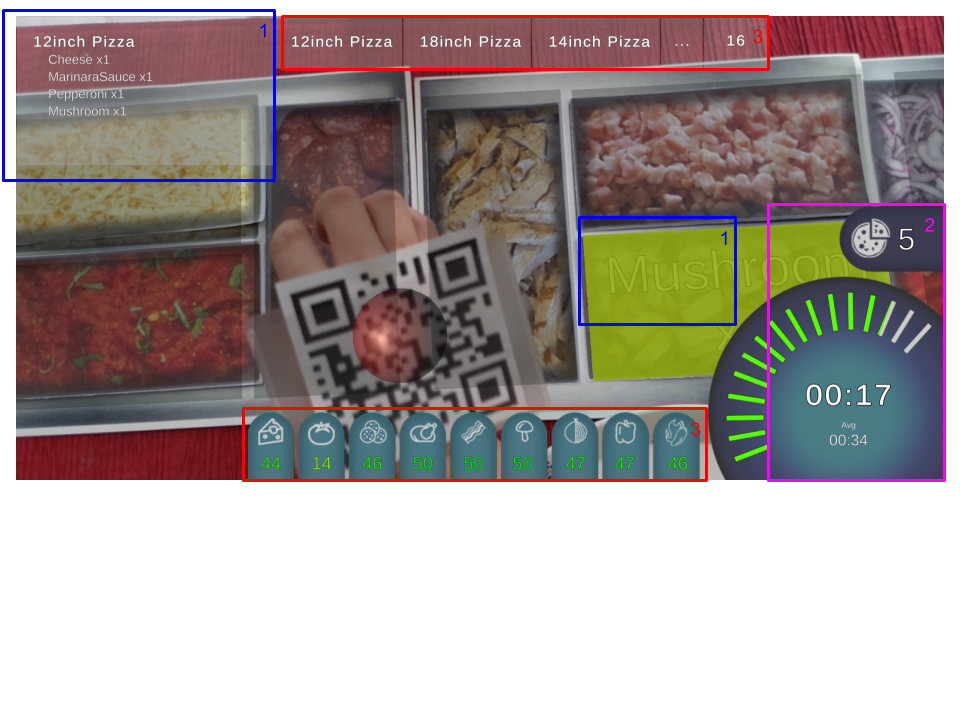

# AR Cooking Aid

Heidi He (MH2484), Ho Kiu Toby Leung (HTL9), Irene Font Peradejordi
(IF76) \| November 10th, 2020

INFO 5340 / CS 5650: Virtual and Augmented Reality

Cornell Tech - Fall 2020

Updates (P3)
------------

Since our previous submission we worked on both the cooking and the
consumer scenes, until achieving our target goals. On the customer side,
we have created photorealistic 3D models of three more available
ingredients -- onions, red peppers, and jalapeno --, and improved the
user experience by following the ARCore Elements design principles.
These include guiding the user through detecting a surface using a
simple and easy to understand icon, showing where the pizza will be
instantiated before it is placed for the users to decide if there is
enough space in the real sceen, created name tags for the ingredients
with an animation effect, light estimation features, offscreen marker
tracker.

On the cooking side, we expanded on our MVP by enhancing and gamifying
the chef's experience with the app. This was accomplished through
various elements in the UI. For example, the scale on the bottom right
corner gives real-time feedback to the chef on how efficient they are in
cooking. The chef is also able to keep track of elements that would
improve their cooking efficiency, for example how many servings of each
ingredient are left. When they notice that the ingredient count is low,
they can ask their sous chef to replenish the stock, and the AR cooking
aid would automatically recognize this action.

Technical Development 
---------------------

In order to keep a consistent build, without having to consider the
project's settings each time, our project will be delivered purely
through AR-capable Android devices. As a result, we will not be touching
on ARKit and solely utilizing the ARFoundation library.

The first challenge we encountered was the remote collaboration of a
Unity project using git. To solve this problem, we created a .gitignore
file for the following files: .DS_Store, Library, Packages, Temp, and
Assembly-CSharp.csproj. By doing this, each team member was able to push
their changes without merging conflicts as long as we worked on
different Unity scenes. Although in P2 we were not able to work on the
same scene for merging conflicts with prefabs and scripts, we fixed this
issue during P3 and were able to resolve merge conflicts in a more
efficient manner.

Please, find attached the complete list of features implemented and work
done as well as who, in our team, was responsible for them:

**\-- P2**

-   **Heidi:** Figured out object instantiation with image tracking. Implemented interactive 3D button with raycast. Constructed the SceneControl hierarchy and built the scene (Ordering3.cs). Implemented the hierarchy functionality of the ordering scene and constructed the scene. Made a responsive order summary. Added sound effects. Figured out ray casting within AR.

-   **Irene**: Implemented plane detection. Implemented the resize of the pizza when touched with two fingers, along with responsive texts showing the sizes. Designed the pizza board as well as the pepperoni prefab using Rhino 3D and created it's texture mapping using Unity 3D.

-   **Toby**: Design Pizza Prefab on Rhino 3D + texture mapping, and albedo on Unity Designed and coded the cooking side of the app.

**\-- P3**

-   **Heidi:** (ordering scene) Made buttons disappear with sparkling effect (submit order), implemented light estimation, edited UX opening animation from the given sample, implement a transparent board stays where the camera is pointing, updated order summary style and reaction, maintain git, make more complicated sound effect, direction marker when pizza is off screen.

-   **Irene:** (ordering scene) responsible for the wood cutting board prefab, made more realistic 3D models with Rhino (pepper, jalapeno, onion), created the animated ingredient tags, created the place order button model, made transparent material, instantiate new ingredients on top of the pizza, created transparent pizza interaction, embellish the ordering scene.

-   **Toby:** (cooking scene) responsible for the cooking scene, expanded on the UI to implement the gamification elements (real-time color coded efficiency scale, current cooking time, average cooking time, pizza counter), added other UI features to expedite cooking time (ingredient stock color-coded countdowns, ingredient name indicators with specific amounts for current order), and augmented MVP UI (top left corner, ingredient count is included)

Hardware & Software Platform/Device
-----------------------------------

Development platform: Unity 2019.4.8f1. AR devices: Android.

### External Assets

> For this project, we made all of our prefabs by ourselves. The only external asset used was ARFoundation. Within this package, we used its plane detection, AR image tracking manager setups, light estimation script, UX sample with edits compatible to our scene.

User Experience
---------------

Since this is an AR app, our team has placed careful consideration into
planning the user experience with the device. We want to take full
advantage of AR that differentiates our project than the experience of a
traditional 2D screen. In addition to the powerful and immersive
experience that an AR app offers, we still aim to keep the UI elements
clear, simple and useful for our users, both the ordering customer and
the chief in the restaurant.

On the customer side, the UI will consist of: (1) pizza size selection,
(2) pizza ingredient selection as well as their desired quantity, and
lastly (3) order generation. Inspired by ARCore Elements, we utilized
objects in the 3D screen as buttons. This action of removing 2D UI
elements that block the screen provides our user with a more holistic AR
experience, since the interactions take place within the 3D space
instead. Once the user opens the app, an animated instruction in the
center of the screen will lead them to find a desired plane where to
start the interaction. Once the plane is found, a silhouette of a wood
cutting board will appear, it will be fixed until the user clicks on the
screen. This interaction follows the principles of ARCore Elements. On
top of the cutting board a silhouette of a pizza will appear, once the
user clicks on it, the silhouette will be replaced by a regular pizza
and all the available toppings will be shown and available to click.
Each ingredient represented by its respective 3D model also contains a
tag specifying their name for clarity. The tag UI follows the ARCore
Elements principles as well. To help our first-time users who are not
familiar with the process, there is an order summary panel in the 3D
space that reports the scene status and instructs the user to take key
actions. Users can resize the pizza and add ingredients until they are
satisfied with the order. The order summary panel updates according to
the current size of the pizza and the amount of the pepperoni added,
providing visual feedback to the user's action. Moreover, there is
seamless acoustic feedback during the scene as well as visual matching -
the light of the virtual world matches the intensity of light source in
the real world.

The placement of ingredients will make use of Unity's physics in order
to generate realistic imagery of a chef making their meal. The user
experience from the customer-side is a key consideration for this
project, as it justifies why our app has to be in AR. For example,
seeing the food items in a perfect perspective scale is necessary for
the customer to judge how much to order. While being able to "witness" a
realistic cooking process of their menu item is necessary for generating
an intimate relationship with one's food and thus a higher appreciation
of it.

On the restaurant's side, the app is geared to be much more utilitarian,
with the ultimate goal of boosting the chef's efficiency and accuracy in
fulfilling the orders received. This is done through a meticulous design
of the UI, with elements of gamification and information augmentation.
In an attempt to design an AR experience that has minimal interruption
with the content behind it, each UI element has been carefully curated
to deliver information that would fall in one of the three categories:
current order, chef efficiency gamified statistics, future orders.

1.  Current order: The current order summary is shown on the top left. This ingredient list is then transcribed into a real-world representation, through glowing the locations and amounts of the necessary ingredients.

2.  Chef efficiency gamified statistics: The timers and color-coded gauge on the bottom right gives the chef real time feedback on their current performance. Furthermore, a pizza counter above the gauge also displays previous accomplishments.

3.  Future orders: Future orders are listed at the top, giving a brief description of the next 3 as well as how many more orders are to be fulfilled. Another tool designed to increase chef efficiency can be seen at the bottom, where a color-coded ingredient countdown lets the chef know when it is necessary to restock.

Each of these features are updated automatically. To use this app,
restaurants need to equip movable supporters that hold the device above
the ingredients, so that we free the chefs' hands for cooking. This is a
proof of concept app for what we call a movable mounted display, with
which the chef will no longer have to consistently shift their gaze
towards a screen in a different direction, but rather simply be fed
augmented information on top of the surface they are working on. The UI
will require no buttons, using only the chef's hand position to trigger
actions and events. This was a decision made due to the factors of
freeing up the chef's hand, sanitary requirements, and providing
immediate interaction.

Summary 
-------

Since the COVID pandemic, restaurants have shifted their menus to web
page versions accessible through a QR code. In order to provide a more
informative, interactive and personalized experience when ordering
delivery, our tool generates an AR visualization of menu items and
allows users to create their own meal, choosing their preferred
ingredients and the quantity of such. Once the order is placed through
the AR app, this will be received by the restaurant, which will utilize
a movable mounted AR display to aid in the chef's cooking process, thus
boosting the restaurant's accuracy and efficiency in producing meal
orders.

Project Description
-------------------

While there has been an increased popularity of food delivery services,
customers currently have a disconnected experience with the menu items
they are ordering. Our app aims to rectify that by essentially
reimagining the entire food delivery process: ranging from the early
steps of cooking the ingredients, all the way to the cooking and
delivery of one's order.

Our AR app will have two different faces to suit the needs of two major
stakeholders in the process: 1) the customer, and 2) the restaurant.

The customer will be able to see a to-scale-visualization of the menu
items available, as well as personally customize their dish, in this
case, a pizza. This is an important feature that is currently missing
from online delivery as customers\' expectations of a dish frequently
misaligns with that received in the delivery. The user would be guided
with implicit instructions for those first time users who are not
familiar with the AR interface.

Another aspect of the app will also service the cook personnel. Each of
the items purchased through our app will be extremely personalized and
tailored though the users tastes, therefore, it may make it challenging
for the cook to be fast at their cooking process, since every element
will be different and require different ingredients. Therefore, we are
proposing an AR screen which will overlay information on top of the
ingredients, such as which ingredients are needed and their quantity to
cook the personalized meal. The ultimate goal of the restaurant-facing
side of the app is to increase accuracy and efficiency in producing the
orders, a win for both the customer and the restaurant.

Deliverables
------------

-   **Minimum Viable Product**:

    -   **Ordering experience:** an AR experience for pizza ordering that interacts with the custom changes the customer applies to the product through the app's UI. The app offers a realistic virtual representation of pizza with the corresponding scale in the real world.

    -   **Cooking experience:** an AR cooking aid tool which aims to boost accuracy and efficiency in producing customers' orders. This would be accomplished through features of: indicating which ingredients are necessary, what an order consists of, and what orders are to follow; essentially replacing and elevating the functionality of monitors currently used in such kitchens.

-   **Target Product**:

    -   **Ordering experience:** Create and introduce more photorealistic 3d models of pizza ingredients in the ordering scene. Improved UI design. Transfer data between the ordering and the kitchen scenes.

    -   **Cooking experience:** Implement the gamification aspect of the app, incentivizing the chef to increase accuracy and efficiency (achieved through measuring and displaying statistics).

-   **Stretch Goals**:

    -   Multiplayer mode: Work on an order together / cook orders with multiple chefs.

Performance Metrics
-------------------

The criteria to judge the product's user experience will be largely focused on 3 main categories: 

1.  Appropriate designation of interactions through UI vs. AR

2.  Stable and accurate performance of AR transformation and visualization

3.  Usability and app accessibility on the restaurant-facing side, proven by the impact it has on their job (e.g. accuracy and efficiency)

Team
----

Irene is a CM'21 student with previous design experience (BA in
Communications and Design - Universitat Pompeu Fabra, Barcelona) and
with strong technical skills (MA in Cognitive Sciences and AI - Tilburg
University, The Netherlands). In that regard, she is interested in
making online communications more human and believes that XR is a great
tool to do so.

Heidi is a CM'21 student who double majored in art and computer science
in undergrad. She had experience in HCI research including one that
studies a novel form of rotating screen. She had been interested in XR
for it bridges the screen space with our physical space. As a full-stack
developer, her technical skills are mainly in front-end development,
Computer Vision and Computer Graphics.

Toby is a UT student with a background in spatial experience design.
Armed by an education that falls in the grey area between interior
design, social psychology, and tech, he has naturally developed a liking
towards revolutionizing human-spatial interaction. In XR he sees a way
to completely reshape how people perceive their surroundings, to
ultimately augment real life with what is simply out of this world.
